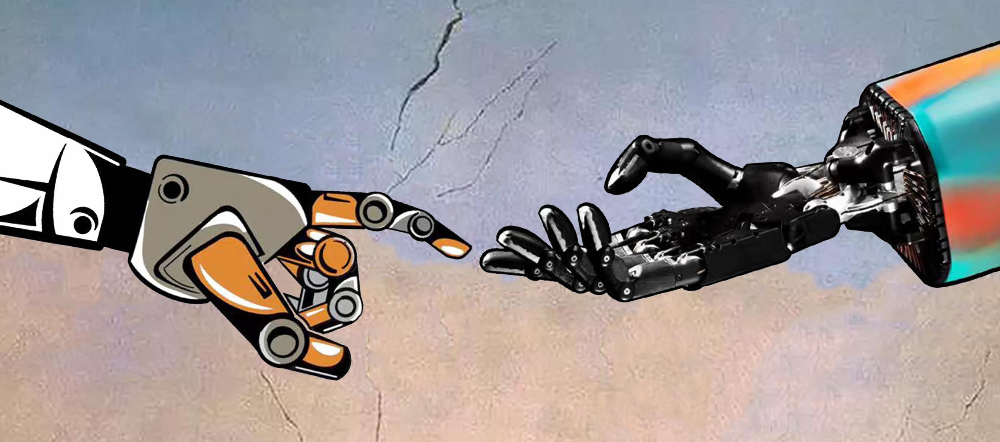
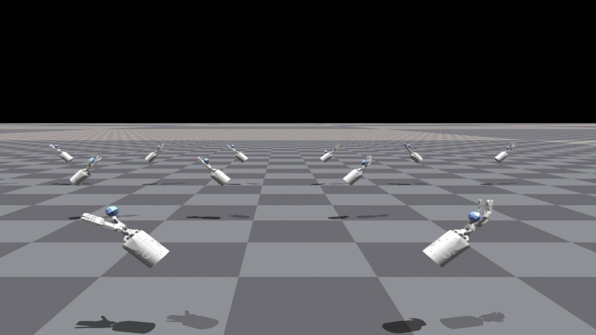
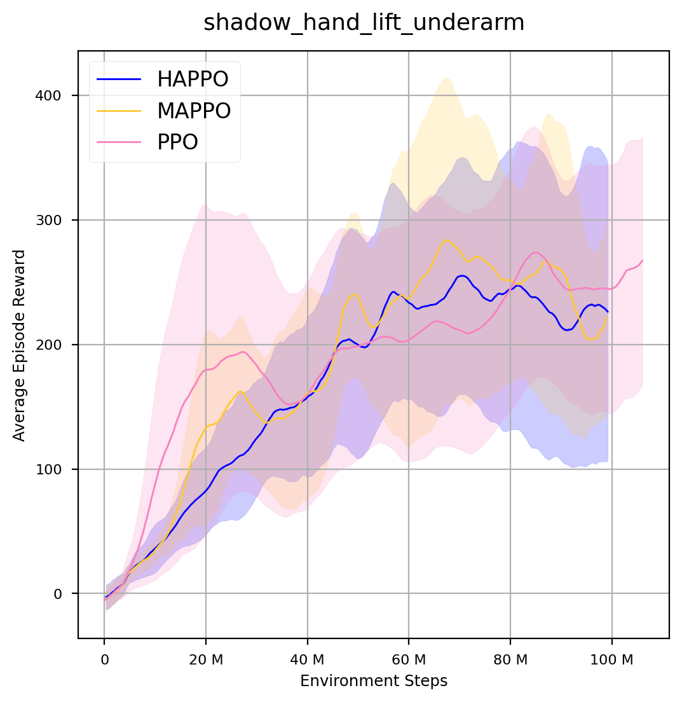
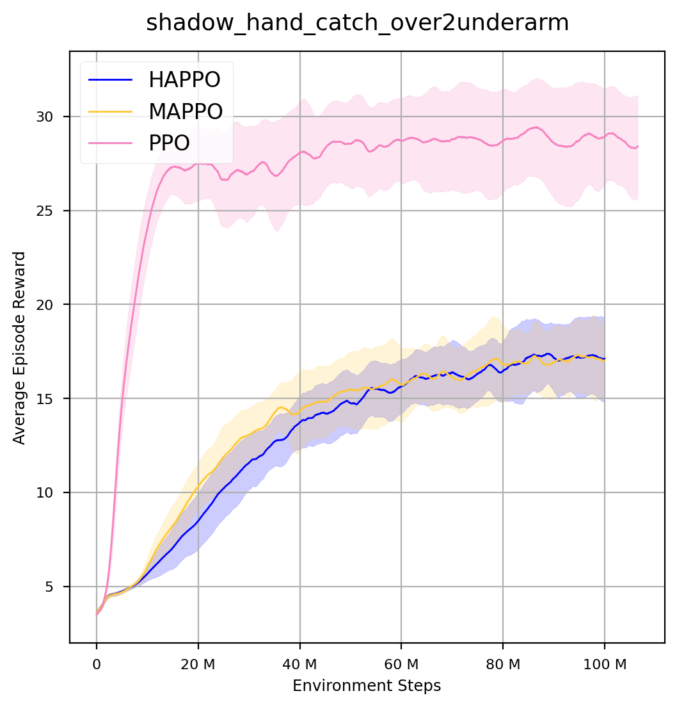
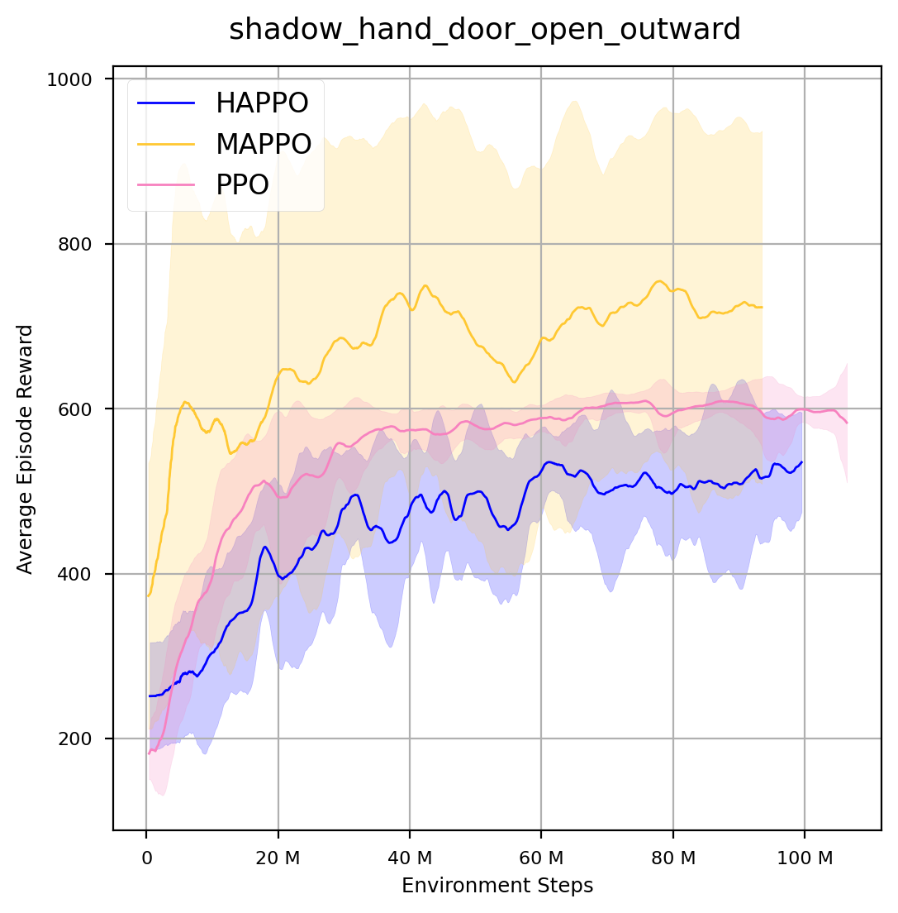
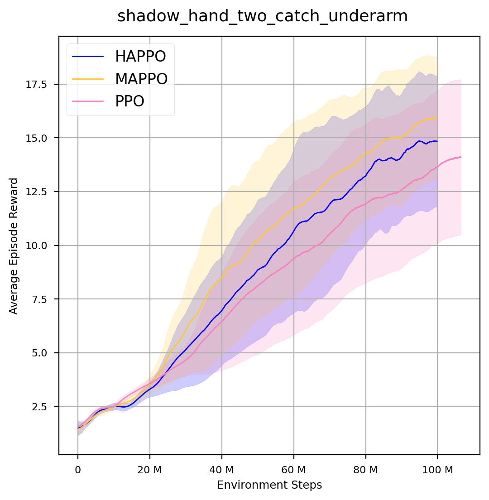
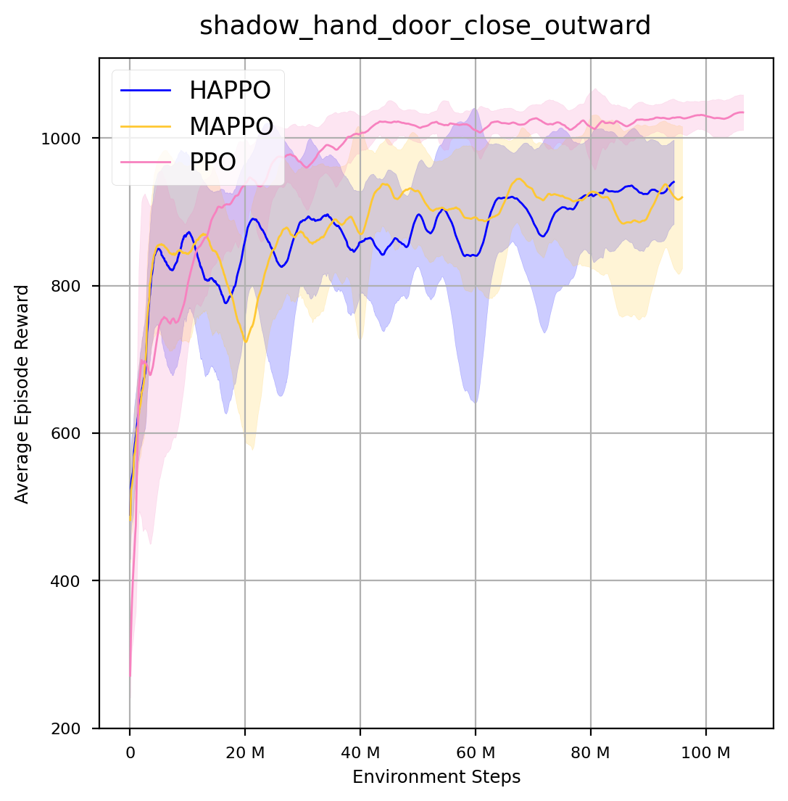

# Bi-DexHands: Bimanual Dexterous Manipulation via Reinforcement Learning


****
[](https://pypi.org/project/bi-dexhands/)
[](https://github.com/PKU-MARL "Organization")
[](https://github.com/PKU-MARL "Unittest")
[](https://github.com/PKU-MARL "Docs")
[](https://github.com/PKU-MARL/DexterousHands/blob/master/LICENSE)

**Bi-DexHands** provides a collection of bimanual dexterous manipulations tasks and reinforcement learning algorithms for solving them. 
Reaching human-level sophistication of hand dexterity and bimanual coordination remains an open challenge for modern robotics researchers. To better help the community study this problem, Bi-DexHands are developed with the following key features:
- **Isaac Efficiency**: Bi-DexHands is built within [Isaac Gym](https://developer.nvidia.com/isaac-gym); it supports running thousands of environments simultaneously. For example, on one NVIDIA RTX 3090 GPU, Bi-DexHands can reach **40,000+ mean FPS** by running  2,048  environments in parallel. 
- **RL/MARL Benchmark**: we provide the first bimanual manipulation task environment for RL and Multi-Agent RL practitioners, along with a comprehensive benchmark for SOTA continuous control model-free RL/MARL methods. See [example](./bi-dexhands/algorithms/marl/)
- **Heterogeneous-agents Cooperation**: Agents in Bi-DexHands (i.e., joints, fingers, hands,...) are genuinely heterogeneous; this is very different from common multi-agent environments such as [SMAC](https://github.com/oxwhirl/smac)  where agents can simply share parameters to solve the task. 
- **Task Generalization**: we introduce a variety of dexterous manipulation tasks (e.g., handover, lift up, throw, place, put...) as well as enormous target objects from the [YCB](https://rse-lab.cs.washington.edu/projects/posecnn/) and [SAPIEN](https://sapien.ucsd.edu/) dataset (>2,000 objects); this allows meta-RL and multi-task RL algorithms to be tested on the task generalization front. 
- **Point Cloud**: We provide the ability to use point clouds as observations. We used the depth camera in Isaacc Gym to get the depth image and then convert it to partial point cloud. We can customize the pose and numbers of depth cameras to get point cloud from difference angles. The density of generated point cloud depends on the number of the camera pixels. See the [code](./bi-dexhands/tasks/shadow_hand_point_cloud.py). 
- **Quick Demos**

<div align=center>

</div> 
 
Bi-DexHands is becoming an important tool to evaluate the performance of RL-based solutions for robotics research. 

- [Installation](#Installation)
  - [Pre-requisites](#Installation)
  - [Install from PyPI](#Install-from-PyPI)
  - [Install from source code](#Install-from-source-code)
- [Introduction to Bi-DexHands](#Introduction-to-Bi-DexHands)
- [Overview of Environments](./docs/environments.md)
- [Overview of Algorithms](./docs/algorithms.md)
- [Getting Started](#Getting-Started)
  - [Tasks](#Tasks)
  - [Training](#Training)
  - [Testing](#Testing)
  - [Plotting](#Plotting)
- [Enviroments Performance](#Enviroments-Performance)
  - [Figures](#Figures)
- [Building the Documentation](#Building-the-Documentation)
- [The Team](#The-Team)
- [License](#License)
<br></br>

****
## Installation

Details regarding installation of IsaacGym can be found [here](https://developer.nvidia.com/isaac-gym). **We currently support the `Preview Release 3` version of IsaacGym.**

### Pre-requisites

The code has been tested on Ubuntu 18.04 with Python 3.7. The minimum recommended NVIDIA driver
version for Linux is `470.74` (dictated by support of IsaacGym).

It uses [Anaconda](https://www.anaconda.com/) to create virtual environments.
To install Anaconda, follow instructions [here](https://docs.anaconda.com/anaconda/install/linux/).

Ensure that Isaac Gym works on your system by running one of the examples from the `python/examples` 
directory, like `joint_monkey.py`. Please follow troubleshooting steps described in the Isaac Gym Preview 3 
install instructions if you have any trouble running the samples.

Once Isaac Gym is installed and samples work within your current python environment, install this repo:

#### Install from PyPI
Bi-DexHands is hosted on PyPI. It requires Python >= 3.7.
You can simply install Bi-DexHands from PyPI with the following command:

```bash
pip install bidexhands
```
#### Install from source code
You can also install this repo from the source code:

```bash
pip install -e .
```

## Introduction

This repository contains complex dexterous hands control tasks. Bi-DexHands is built in the NVIDIA Isaac Gym with high performance guarantee for training RL algorithms. Our environments focus on applying model-free RL/MARL algorithms for bimanual dexterous manipulation, which are considered as a challenging task for traditional control methods. 

## Getting Started

### <span id="task">Tasks</span>

Source code for tasks can be found in `envs/tasks`. The detailed settings of state/action/reward are in [here](./docs/environments.md).

So far, we release the following tasks (with many more to come):

| Environments | Description | Demo     |
|  :----:  | :----:  | :----:  |
|ShadowHand Over| These environments involve two fixed-position hands. The hand which starts with the object must find a way to hand it over to the second hand. |     |
|ShadowHandCatch Underarm|These environments again have two hands, however now they have some additional degrees of freedom that allows them to translate/rotate their centre of masses within some constrained region. |     |
|ShadowHandCatch Over2Underarm| This environment is is made up of half ShadowHandCatchUnderarm and half ShadowHandCatchOverarm, the object needs to be thrown from the vertical hand to the palm-up hand |     |
|ShadowHandCatch Abreast| This environment is similar to ShadowHandCatchUnderarm, the difference is that the two hands are changed from relative to side-by-side posture. |     |
|ShadowHandCatch TwoCatchUnderarm| These environments involve coordination between the two hands so as to throw the two objects between hands (i.e. swapping them). |     |
|ShadowHandLift Underarm | This environment requires grasping the pot handle with two hands and lifting the pot to the designated position  |     |
|ShadowHandDoor OpenInward | This environment requires the closed door to be opened, and the door can only be pulled inwards |     |
|ShadowHandDoor OpenOutward | This environment requires a closed door to be opened and the door can only be pushed outwards  |     |
|ShadowHandDoor CloseInward | This environment requires the open door to be closed, and the door is initially open inwards |     |
|ShadowHand BottleCap | This environment involves two hands and a bottle, we need to hold the bottle with one hand and open the bottle cap with the other hand  |     |
<!-- |ShadowHandDoor CloseOutward | This environment requires the open door to be closed, and the door is initially open outwards  |     | -->


### Training

#### Gym-Like API

We provide a Gym-Like API that allows us to get information from the Isaac Gym environment. Our single-agent Gym-Like wrapper is the code of the Isaac Gym team used, and we have developed a multi-agent Gym-Like wrapper based on it:

```python
class MultiVecTaskPython(MultiVecTask):
    # Get environment state information
    def get_state(self):
        return torch.clamp(self.task.states_buf, -self.clip_obs, self.clip_obs).to(self.rl_device)

    def step(self, actions):
        # Stack all agent actions in order and enter them into the environment
        a_hand_actions = actions[0]
        for i in range(1, len(actions)):
            a_hand_actions = torch.hstack((a_hand_actions, actions[i]))
        actions = a_hand_actions
        # Clip the actions
        actions_tensor = torch.clamp(actions, -self.clip_actions, self.clip_actions)
        self.task.step(actions_tensor)
        # Obtain information in the environment and distinguish the observation of different agents by hand
        obs_buf = torch.clamp(self.task.obs_buf, -self.clip_obs, self.clip_obs).to(self.rl_device)
        hand_obs = []
        hand_obs.append(torch.cat([obs_buf[:, :self.num_hand_obs], obs_buf[:, 2*self.num_hand_obs:]], dim=1))
        hand_obs.append(torch.cat([obs_buf[:, self.num_hand_obs:2*self.num_hand_obs], obs_buf[:, 2*self.num_hand_obs:]], dim=1))
        rewards = self.task.rew_buf.unsqueeze(-1).to(self.rl_device)
        dones = self.task.reset_buf.to(self.rl_device)
        # Organize information into Multi-Agent RL format
        # Refer to https://github.com/tinyzqh/light_mappo/blob/HEAD/envs/env.py
        sub_agent_obs = []
        ...
        sub_agent_done = []
        for i in range(len(self.agent_index[0] + self.agent_index[1])):
            ...
            sub_agent_done.append(dones)
        # Transpose dim-0 and dim-1 values
        obs_all = torch.transpose(torch.stack(sub_agent_obs), 1, 0)
        ...
        done_all = torch.transpose(torch.stack(sub_agent_done), 1, 0)
        return obs_all, state_all, reward_all, done_all, info_all, None

    def reset(self):
        # Use a random action as the first action after the environment reset
        actions = 0.01 * (1 - 2 * torch.rand([self.task.num_envs, self.task.num_actions * 2], dtype=torch.float32, device=self.rl_device))
        # step the simulator
        self.task.step(actions)
        # Get the observation and state buffer in the environment, the detailed are the same as step(self, actions)
        obs_buf = torch.clamp(self.task.obs_buf, -self.clip_obs, self.clip_obs)
        ...
        obs = torch.transpose(torch.stack(sub_agent_obs), 1, 0)
        state_all = torch.transpose(torch.stack(agent_state), 1, 0)
        return obs, state_all, None
```
#### RL/Multi-Agent RL API

We also provide single-agent and multi-agent RL interfaces. In order to adapt to Isaac Gym and speed up the running efficiency, all operations are implemented on GPUs using tensor. Therefore, there is no need to transfer data between the CPU and GPU.

We give an example using ***HATRPO (the SOTA MARL algorithm for cooperative tasks)*** to illustrate multi-agent RL APIs, please refer to [https://github.com/cyanrain7/TRPO-in-MARL](https://github.com/cyanrain7/TRPO-in-MARL):

```python
from algorithms.marl.hatrpo_trainer import HATRPO as TrainAlgo
from algorithms.marl.hatrpo_policy import HATRPO_Policy as Policy
...
# warmup before the main loop starts
self.warmup()
# log data
start = time.time()
episodes = int(self.num_env_steps) // self.episode_length // self.n_rollout_threads
train_episode_rewards = torch.zeros(1, self.n_rollout_threads, device=self.device)
# main loop
for episode in range(episodes):
    if self.use_linear_lr_decay:
        self.trainer.policy.lr_decay(episode, episodes)
    done_episodes_rewards = []
    for step in range(self.episode_length):
        # Sample actions
        values, actions, action_log_probs, rnn_states, rnn_states_critic = self.collect(step)
        # Obser reward and next obs
        obs, share_obs, rewards, dones, infos, _ = self.envs.step(actions)
        dones_env = torch.all(dones, dim=1)
        reward_env = torch.mean(rewards, dim=1).flatten()
        train_episode_rewards += reward_env
        # Record reward at the end of each episode
        for t in range(self.n_rollout_threads):
            if dones_env[t]:
                done_episodes_rewards.append(train_episode_rewards[:, t].clone())
                train_episode_rewards[:, t] = 0

        data = obs, share_obs, rewards, dones, infos, \
                values, actions, action_log_probs, \
                rnn_states, rnn_states_critic
        # insert data into buffer
        self.insert(data)

    # compute return and update network
    self.compute()
    train_infos = self.train()
    # post process
    total_num_steps = (episode + 1) * self.episode_length * self.n_rollout_threads
    # save model
    if (episode % self.save_interval == 0 or episode == episodes - 1):
        self.save()
```

#### Training Examples

For example, if you want to train a policy for the ShadowHandOver task by the PPO algorithm, run this line in `bi-dexhands` folder:

```bash
python train.py --task=ShadowHandOver --algo=ppo
```

To select an algorithm, pass `--algo=ppo/mappo/happo/hatrpo/...` 
as an argument. For example, if you want to use happo algorithm, run this line in `bi-dexhands` folder:

```bash
python train.py --task=ShadowHandOver --algo=hatrpo
``` 

Supported Single-Agent RL algorithms are listed below:

- [Proximal Policy Optimization (PPO)](https://arxiv.org/pdf/1707.06347.pdf)
- [Trust Region Policy Optimization (TRPO)](https://arxiv.org/pdf/1502.05477.pdf)
- [Twin Delayed DDPG (TD3)](https://arxiv.org/pdf/1802.09477.pdf)
- [Soft Actor-Critic (SAC)](https://arxiv.org/pdf/1812.05905.pdf)
- [Deep Deterministic Policy Gradient (DDPG)](https://arxiv.org/pdf/1509.02971.pdf)

Supported Multi-Agent RL algorithms are listed below:

- [Heterogeneous-Agent Proximal Policy Optimization (HAPPO)](https://arxiv.org/pdf/2109.11251.pdf)
- [Heterogeneous-Agent Trust Region Policy Optimization (HATRPO)](https://arxiv.org/pdf/2109.11251.pdf)
- [Multi-Agent Proximal Policy Optimization (MAPPO)](https://arxiv.org/pdf/2103.01955.pdf)
- [Independent Proximal Policy Optimization (IPPO)](https://arxiv.org/pdf/2011.09533.pdf)
- [Multi-Agent Deep Deterministic Policy Gradient  (MADDPG)](https://arxiv.org/pdf/1706.02275.pdf)

For a brief introduction to these algorithms, please refer to [here](./docs/algorithms.md)

### Testing

The trained model will be saved to `logs/${Task Name}/${Algorithm Name}`folder.

To load a trained model and only perform inference (no training), pass `--test` 
as an argument, and pass `--model_dir` to specify the trained models which you want to load.
For single-agent reinforcement learning, you need to pass `--model_dir` to specify exactly what .pt model you want to load. An example of PPO algorithm is as follows:

```bash
python train.py --task=ShadowHandOver --algo=ppo --model_dir=logs/shadow_hand_over/ppo/ppo_seed0/model_5000.pt --test
```

For multi-agent reinforcement learning, pass `--model_dir` to specify the path to the folder where all your agent model files are saved. An example of HAPPO algorithm is as follows:

```bash
python train.py --task=ShadowHandOver --algo=happo --model_dir=logs/shadow_hand_over/happo/models_seed0 --test
```

### Plotting

Users can convert all tfevent files into csv files and then try plotting the results. Note that you should verify `env-num` and `env-step` same as your experimental setting. For the details, please refer to the `./utils/logger/tools.py`.

```bash
# geenrate csv for sarl and marl algorithms
$ python ./utils/logger/tools.py --alg-name <sarl algorithm> --alg-type sarl --env-num 2048 --env-step 8 --root-dir ./logs/shadow_hand_over --refresh 
$ python ./utils/logger/tools.py --alg-name <marl algorithm> --alg-type marl --env-num 2048 --env-step 8 --root-dir ./logs/shadow_hand_over --refresh 
# generate figures
$ python ./utils/logger/plotter.py --root-dir ./logs/shadow_hand_over --shaded-std --legend-pattern "\\w+"  --output-path=./logs/shadow_hand_over/figure.png
```

## Enviroment Performance

### Figures

We provide stable and reproducible baselins run by **PPO, HAPPO, MAPPO** algorithms. All baselines are run under the parameters of `2048 num_env` and `100M total_step`. 

<table>
    <tr>
        <th colspan="2">ShadowHandOver</th>
        <th colspan="2">ShadowHandLiftUnderarm</th>
    <tr>
    <tr>
        <td></td>
        <td></td>
        <td></td>
        <td></td>
    <tr>
    <tr>
        <th colspan="2">ShadowHandCatchUnderarm</th>
        <th colspan="2">ShadowHandDoorOpenInward</th>
    <tr>
    <tr>
        <td></td>
        <td></td>
        <td></td>
        <td></td>
    <tr>
    <tr>
        <th colspan="2">ShadowHandCatchOver2Underarm</th>
        <th colspan="2">ShadowHandDoorOpenOutward</th>
    <tr>
    <tr>
        <td></td>
        <td></td>
        <td></td>
        <td></td>
    <tr>
    <tr>
        <th colspan="2">ShadowHandCatchAbreast</th>
        <th colspan="2">ShadowHandDoorCloseInward</th>
    <tr>
    <tr>
        <td></td>
        <td></td>
        <td></td>
        <td></td>
    <tr>
    <tr>
        <th colspan="2">ShadowHandCatchTwoCatchUnderarm</th>
        <th colspan="2">ShadowHandDoorCloseOutward</th>
    <tr>
    <tr>
        <td></td>
        <td></td>
        <td></td>
        <td></td>
    <tr>
</table>

For more figures please refer to [here](./docs/figures.md)

<!-- ## Building the Documentation

To build documentation in various formats, you will need [Sphinx](http://www.sphinx-doc.org) and the
readthedocs theme.

```bash
cd docs/
pip install -r requirements.txt
```
You can then build the documentation by running `make <format>` from the
`docs/` folder. Run `make` to get a list of all available output formats.

If you get a katex error run `npm install katex`.  If it persists, try
`npm install -g katex` -->

## Future Plan

### Tasks under development:  
  - [x] Handover, throw&catch (a 9-month-old child's behavior)
  - [ ] Pick up eyeglasses  ( an 1-year-old child's behavior )
  - [ ] Stack blocks (an 1-year-old child's behavior )
  - [ ] Put off a pen cap (a 30-month-old child's behavior)
  - [x] Open/Close a door (a 30-month-old child's behavior)
  - [ ] Unscrew a bottle top (a 30-month-old child's behavior)
  - [x] Lift a pot (a 2-year-old child's behavior)
  - [ ] Turn buttons off/on (a 5-year-old child's behavior)
  - [ ] Pour water in a teapot (an adult's behavior)

### Meta/Multi-task algorithms:
  - [ ] Multi-task PPO
  - [ ] Multi-task TRPO
  - [ ] Multi-task SAC
  - [ ] MAML
  - [ ] RL<sup>2 </sup>
  - [ ] PEARL

### Known issue

It must be pointed out that Bi-DeHands is still under development, and there are some known issue: 
- **ShadowHandBottleCap** and **ShadowHandLiftUnderarm** environment may report errors due to collision calculation bugs in the later stage of program runtime.
```
RuntimeError: CUDA error: an illegal memory access was encountered
CUDA kernel errors might be asynchronously reported at some other API call,so the stacktrace below might be incorrect.
```
- Although we provide the implementation, we did not tested **DDPG**, **TD3** and **MADDPG** algorithms, they may still have bugs.


## The Team

Bi-DexHands is a project contributed by 
 [Yuanpei Chen](https://github.com/cypypccpy),[Shengjie Wang](https://github.com/Shengjie-bob), [Hao Dong](https://zsdonghao.github.io), [Zongqing Lu](https://z0ngqing.github.io), [Yaodong Yang](https://www.yangyaodong.com/) at Peking University, please contact yaodong.yang@pku.edu.cn if you are interested to collaborate.


We also thank the list of contributors from the following two open source repositories: 
[Isaac Gym](https://github.com/NVIDIA-Omniverse/IsaacGymEnvs), [HATRPO](https://github.com/cyanrain7/TRPO-in-MARL) 


## License

Bi-DexHands has a Apache license, as found in the [LICENSE](LICENSE) file.
