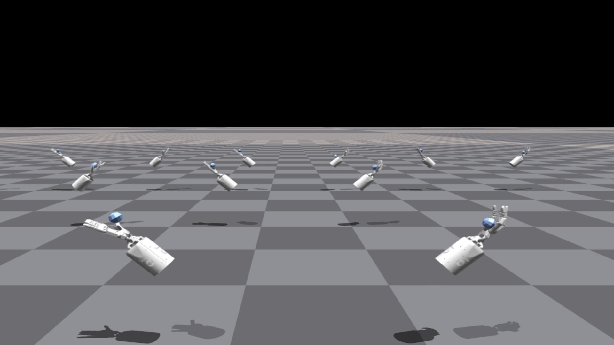
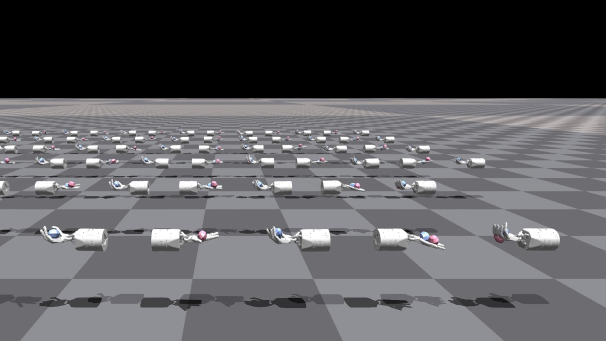

## Environments

This repository contains complex dexterous hand RL environments bi-dexhands for the NVIDIA Isaac Gym high performance environments. bi-dexhands is a very challenging dexterous hand manipulation environment for multi-agent reinforcement learning. We refer to some designs of existing multi-agent and dexterous hand environments, integrate their advantages, expand some new environments and unique features for multi-agent reinforcement learning. Our environments focus on the application of multi-agent algorithms to dexterous hand control, which is very challenging in traditional control algorithms. 

We provide a detailed description of the environment here. For single-agent reinforcement learning, all states and actions are used. For multi-agent reinforcement learning, we use the most common one: each hand as an agent, and a total of two agents as an example to illustrate.

| Environments | ShadowHandOver | ShadowHandCatchUnderarm | ShadowHandTwoCatchUnderarm | ShadowHandCatchAbreast | ShadowHandOver2Underarm |
|  :----:  | :----:  | :----:  | :----:  | :----:  | :----:  |
| Description | These environments involve two fixed-position hands. The hand which starts with the object must find a way to hand it over to the second hand. | These environments again have two hands, however now they have some additional degrees of freedom that allows them to translate/rotate their centre of masses within some constrained region. | These environments involve coordination between the two hands so as to throw the two objects between hands (i.e. swapping them). | This environment is similar to ShadowHandCatchUnderarm, the difference is that the two hands are changed from relative to side-by-side posture. | This environment is is made up of half ShadowHandCatchUnderarm and half ShadowHandCatchOverarm, the object needs to be thrown from the vertical hand to the palm-up hand |
| Actions Type | Continuous | Continuous | Continuous | Continuous | Continuous |
| Total Action Num | 40    | 52    | 52    | 52    | 52    |
| Action Values     | [-1, 1]    | [-1, 1]    | [-1, 1]    | [-1, 1]    | [-1, 1]    |
| Action Index and Description     | [detail](#action1)    | [detail](#action2)   | [detail](#action3)    | [detail](#action4)    | [detail](#action5)    |
| Observation Shape     | (num_envs, 2, 211)    | (num_envs, 2, 217)    | (num_envs, 2, 217)    | (num_envs, 2, 217)    | (num_envs, 2, 217)    |
| Observation Values     | [-5, 5]    | [-5, 5]    | [-5, 5]    | [-5, 5]    | [-5, 5]    |
| Observation Index and Description     | [detail](#obs1)    | [detail](#obs2)   | [detail](#obs3)    | [detail](#obs4)    | [detail](#obs4)    |
| State Shape     | (num_envs, 2, 398)    | (num_envs, 2, 422)    | (num_envs, 2, 422)    | (num_envs, 2, 422)    | (num_envs, 2, 422)    | 
| State Values     | [-5, 5]    | [-5, 5]    | [-5, 5]    | [-5, 5]    | [-5, 5]    |
| Rewards     | Rewards is the pose distance between object and goal. You can check out the details [here](#r1)| Rewards is the pose distance between object and goal. You can check out the details [here](#r2)    | Rewards is the pose distance between object and goal. You can check out the details [here](#r3)    | Rewards is the pose distance between two object and  two goal, this means that both objects have to be thrown in order to be swapped over. You can check out the details [here](#r4)    | Rewards is the pose distance between object and goal. You can check out the details [here](#r2)    |
| Demo     |     |     |     |     |     |


### HandOver Environments


These environments involve two fixed-position hands. The hand which starts with the object must find a way to hand it over to the second hand. To use the HandOver environment, pass `--task=ShadowHandOver`

#### <span id="obs1">Observation Space</span>

| Index | Description |
|  :----:  | :----:  |
| 0 - 23 | shadow hand dof position |
| 24 - 47     | shadow hand dof velocity    |
| 48 - 71     | shadow hand dof force    |
| 72 - 136    | shadow hand fingertip pose, linear velocity, angle velocity (5 x 13) |
| 137 - 166     | shadow hand fingertip force, torque (5 x 6)    |
| 167 - 186     | actions    |
| 187 - 193     | object pose   |
| 194 - 196     | object linear velocity    |
| 197 - 199     | object angle velocity    |
| 200 - 206     | goal pose    |
| 207 - 210     | goal rot - object rot   |

#### Action Space<span id="action1">Action Space</span>
The shadow hand has 24 joints, 20 actual drive joints and 4 underdrive joints. So our Action is the joint Angle value of the 20 dimensional actuated joint.
| Index | Description |
|  ----  | ----  |
| 0 - 19 | shadow hand actuated joint |

#### <span id="r1">Rewards</span>
Rewards is the pose distance between object and goal, and the specific formula is as follows:
```python
goal_dist = torch.norm(target_pos - object_pos, p=2, dim=-1)

quat_diff = quat_mul(object_rot, quat_conjugate(target_rot))
rot_dist = 2.0 * torch.asin(torch.clamp(torch.norm(quat_diff[:, 0:3], p=2, dim=-1), max=1.0))

dist_rew = goal_dist

reward = torch.exp(-0.2*(dist_rew * dist_reward_scale + rot_dist))
```

### HandCatchUnderarm Environments


These environments again have two hands, however now they have some additional degrees of freedom that allows them to translate/rotate their centre of masses within some constrained region. To use the HandCatchUnderarm environment, pass `--task=ShadowHandCatchUnderarm`

#### #### <span id="obs2">Observation Space</span>


| Index | Description |
|  :----:  | :----:  |
| 0 - 23 | shadow hand dof position |
| 24 - 47     | shadow hand dof velocity    |
| 48 - 71     | shadow hand dof force    |
| 72 - 136    | shadow hand fingertip pose, linear velocity, angle velocity (5 x 13) |
| 137 - 166     | shadow hand fingertip force, torque (5 x 6)    |
| 167 - 192     | actions    |
| 193 - 195     | shadow hand transition    |
| 196 - 198     | shadow hand orientation    |
| 199 - 205     | object pose   |
| 206 - 208     | object linear velocity    |
| 209 - 211     | object angle velocity    |
| 212 - 218     | goal pose    |
| 219 - 222     | goal rot - object rot   |

#### Action Space<span id="action2">Action Space</span>

Similar to the HandOver environments, except now the bases are not fixed and have translational and rotational degrees of freedom that allow them to move within some range.
| Index | Description |
|  :----:  | :----:  |
| 0 - 19 | shadow hand actuated joint |
| 20 - 22 | shadow hand actor translation |
| 23 - 25 | shadow hand actor rotation |

#### <span id="r2">Rewards</span>

Rewards is the pose distance between object and goal, and the specific formula is as follows:
```python
goal_dist = torch.norm(target_pos - object_pos, p=2, dim=-1)

quat_diff = quat_mul(object_rot, quat_conjugate(target_rot))
rot_dist = 2.0 * torch.asin(torch.clamp(torch.norm(quat_diff[:, 0:3], p=2, dim=-1), max=1.0))

dist_rew = goal_dist

reward = torch.exp(-0.2*(dist_rew * dist_reward_scale + rot_dist))
```

### HandCatchOverarm Environments


Similar to the HandCatchUnderArm environments but now the two hands are upright, and so the throwing/catching technique that has to be employed is different. To use the HandCatchUnderarm environment, pass `--task=ShadowHandCatchOverarm`

#### #### <span id="obs3">Observation Space</span>


| Index | Description |
|  :----:  | :----:  |
| 0 - 23 | shadow hand dof position |
| 24 - 47     | shadow hand dof velocity    |
| 48 - 71     | shadow hand dof force    |
| 72 - 136    | shadow hand fingertip pose, linear velocity, angle velocity (5 x 13) |
| 137 - 166     | shadow hand fingertip force, torque (5 x 6)    |
| 167 - 192     | actions    |
| 193 - 195     | shadow hand transition    |
| 196 - 198     | shadow hand orientation    |
| 199 - 205     | object pose   |
| 206 - 208     | object linear velocity    |
| 209 - 211     | object angle velocity    |
| 212 - 218     | goal pose    |
| 219 - 222     | goal rot - object rot   |

#### Action Space<span id="action3">Action Space</span>

Similar to the HandOver environments, except now the bases are not fixed and have translational and rotational degrees of freedom that allow them to move within some range.
| Index | Description |
|  :----:  | :----:  |
| 0 - 19 | shadow hand actuated joint |
| 20 - 22 | shadow hand actor translation |
| 23 - 25 | shadow hand actor rotation |

#### <span id="r3">Rewards</span>

Rewards is the pose distance between object and goal, and the specific formula is as follows:
```python
goal_dist = torch.norm(target_pos - object_pos, p=2, dim=-1)
# Orientation alignment for the cube in hand and goal cube
quat_diff = quat_mul(object_rot, quat_conjugate(target_rot)
reward = (0.3 - goal_dist - quat_diff)
```

### TwoObjectCatch Environments


These environments involve coordination between the two hands so as to throw the two objects between hands (i.e. swapping them). This is necessary since each object's goal can only be reached by the other hand. To use the HandCatchUnderarm environment, pass `--task=ShadowHandTwoCatchUnderarm`

#### #### <span id="obs4">Observation Space</span>


| Index | Description |
|  :----:  | :----:  |
| 0 - 23 | shadow hand dof position |
| 24 - 47     | shadow hand dof velocity    |
| 48 - 71     | shadow hand dof force    |
| 72 - 136    | shadow hand fingertip pose, linear velocity, angle velocity (5 x 13) |
| 137 - 166     | shadow hand fingertip force, torque (5 x 6)    |
| 167 - 192     | actions    |
| 193 - 195     | shadow hand transition    |
| 196 - 198     | shadow hand orientation    |
| 199 - 205     | object1 pose   |
| 206 - 208     | object1 linear velocity    |
| 210 - 212     | object1 angle velocity    |
| 213 - 219     | goal1 pose    |
| 220 - 223     | goal1 rot - object1 rot   |
| 224 - 230     | object2 pose   |
| 231 - 233     | object2 linear velocity    |
| 234 - 236     | object2 angle velocity    |
| 237 - 243     | goal2 pose    |
| 244 - 247     | goal2 rot - object2 rot   |

#### Action Space<span id="action4">Action Space</span>

Similar to the HandOver environments, except now the bases are not fixed and have translational and rotational degrees of freedom that allow them to move within some range.
| Index | Description |
|  :----:  | :----:  |
| 0 - 19 | shadow hand actuated joint |
| 20 - 22 | shadow hand actor translation |
| 23 - 25 | shadow hand actor rotation |

#### <span id="r4">Rewards</span>

Rewards is the pose distance between two object and  two goal, this means that both objects have to be thrown in order to be swapped over. The specific formula is as follows:
```python
goal_dist = torch.norm(target_pos - object_pos, p=2, dim=-1)
goal_another_dist = torch.norm(target_another_pos - object_another_pos, p=2, dim=-1)

# Orientation alignment for the cube in hand and goal cube
quat_diff = quat_mul(object_rot, quat_conjugate(target_rot))
rot_dist = 2.0 * torch.asin(torch.clamp(torch.norm(quat_diff[:, 0:3], p=2, dim=-1), max=1.0))

quat_another_diff = quat_mul(object_another_rot, quat_conjugate(target_another_rot))
rot_another_dist = 2.0 * torch.asin(torch.clamp(torch.norm(quat_another_diff[:, 0:3], p=2, dim=-1), max=1.0))

dist_rew = goal_dist

reward = torch.exp(-0.2*(dist_rew * dist_reward_scale + rot_dist)) + torch.exp(-0.2*(goal_another_dist * dist_reward_scale + rot_another_dist))
```

### HandCatchAbreast Environments


These environments again have two hands, however now they have some additional degrees of freedom that allows them to translate/rotate their centre of masses within some constrained region. To use the HandCatchUnderarm environment, pass `--task=ShadowHandCatchAbreast`

#### #### <span id="obs5">Observation Space</span>


| Index | Description |
|  :----:  | :----:  |
| 0 - 23 | shadow hand dof position |
| 24 - 47     | shadow hand dof velocity    |
| 48 - 71     | shadow hand dof force    |
| 72 - 136    | shadow hand fingertip pose, linear velocity, angle velocity (5 x 13) |
| 137 - 166     | shadow hand fingertip force, torque (5 x 6)    |
| 167 - 192     | actions    |
| 193 - 195     | shadow hand transition    |
| 196 - 198     | shadow hand orientation    |
| 199 - 205     | object pose   |
| 206 - 208     | object linear velocity    |
| 209 - 211     | object angle velocity    |
| 212 - 218     | goal pose    |
| 219 - 222     | goal rot - object rot   |

#### Action Space<span id="action5">Action Space</span>

Similar to the HandOver environments, except now the bases are not fixed and have translational and rotational degrees of freedom that allow them to move within some range.
| Index | Description |
|  :----:  | :----:  |
| 0 - 19 | shadow hand actuated joint |
| 20 - 22 | shadow hand actor translation |
| 23 - 25 | shadow hand actor rotation |

#### <span id="r5">Rewards</span>

Rewards is the pose distance between object and goal, and the specific formula is as follows:
```python
goal_dist = torch.norm(target_pos - object_pos, p=2, dim=-1)

quat_diff = quat_mul(object_rot, quat_conjugate(target_rot))
rot_dist = 2.0 * torch.asin(torch.clamp(torch.norm(quat_diff[:, 0:3], p=2, dim=-1), max=1.0))

dist_rew = goal_dist

reward = torch.exp(-0.2*(dist_rew * dist_reward_scale + rot_dist))
```
