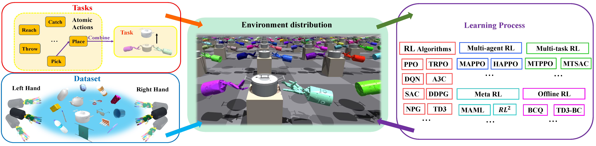

# Bi-DexHands: Towards Human-Level Bimanual Dexterous Manipulation with Reinforcement Learning

We propose a bimanual dexterous manipulation benchmark (Bi-DexHands) according to literature from cognitive science for comprehensive reinforcement learning research.

## Introduction

Achieving human-level dexterity is an important open problem in robotics. However, tasks of dexterous hand manipulation, even at the baby level, are challenging to solve through reinforcement learning (RL). The difficulty lies in the high degrees of freedom and the required cooperation among heterogeneous agents (e.g., joints of fingers). In this study, we propose the **Bi**manual **Dex**terous **Hands** Benchmark (Bi-DexHands), a simulator that involves two dexterous hands with tens of bimanual manipulation tasks and thousands of target objects. Specifically, tasks in Bi-DexHands are designed to match different levels of human motor skills according to cognitive science literature. We built Bi-DexHands  in the Issac Gym; this enables highly efficient RL training,  reaching 30,000+ FPS by only one single NVIDIA RTX 3090. 

We provide a comprehensive benchmark for popular RL algorithms under different settings; this includes **Single-agent/Multi-agent RL, Offline RL, Multi-task RL, and Meta RL**. Our results show that the PPO type of on-policy algorithms can master simple manipulation tasks that are equivalent up to 48-month human babies (e.g., catching a flying object, opening a bottle), while multi-agent RL can further help to master manipulations that require skilled bimanual cooperation (e.g., lifting a pot, stacking blocks). Despite the success on each single task, when it comes to acquiring multiple manipulation skills, existing RL algorithms fail to work in most of the multi-task and the few-shot learning settings, which calls for more substantial development from the RL community. 

Our project is open sourced at [https://github.com/PKU-MARL/DexterousHands](https://github.com/PKU-MARL/DexterousHands).

## Demo

## Framework
Framework of Bi-DexHands, a bechmark for learning bimanual dexterous manipulation.

## Results

We conduct a full benchmark of the RL algorithms. All of our experiments are run with Intel i7-9700K CPU @ 3.60GHz and NVIDIA RTX 3090 GPU.

### RL/MARL results
Currently, we only evaluate the performance of [PPO](https://arxiv.org/abs/1707.06347), [SAC](https://arxiv.org/abs/1801.01290), [MAPPO](https://arxiv.org/abs/2103.01955), and [HAPPO](https://arxiv.org/abs/2109.11251) algorithms on these 20 tasks, and we implemented the rest of the RL/MARL algorithms in our Github repository. Learning curves for all 20 tasks is shown in below. The shaded region represents the standard deviation of the score over 10 trials. Curves are smoothed uniformly for visual clarity. All algorithms interact with environments in 100M steps and the number of parallel simulations is 2048.

### Offline RL results

We evaluate behavior cloning (BC), [BCQ](http://proceedings.mlr.press/v97/fujimoto19a.html), [TD3+BC](https://proceedings.neurips.cc/paper/2021/hash/a8166da05c5a094f7dc03724b41886e5-Abstract.html), and [IQL](https://arxiv.org/abs/2110.06169) on two tasks, Hand Over and Door Open Outward, and report normalized scores in below.

<table>
    <tr>
        <th>Tasks</th>
        <th>Datasets</th>
        <th>Online PPO</th>
        <th>BC</th>
        <th>BCQ</th>
        <th>TD3+BC</th>
        <th>IQL</th>
    </tr>
    <tr>
        <td rowspan="4">HandOver</td>
        <td>random</td>
        <td>100.0</td>
        <td>0.7</td>
        <td>1.0</td>
        <td>0.9</td>
        <td>0.7</td>
    </tr>
    <tr>
        <td>replay</td>
        <td>100.0</td>
        <td>17.5</td>
        <td>61.6</td>
        <td>70.1</td>
        <td>43.1</td>
    </tr>
    <tr>
        <td>medium</td>
        <td>100.0</td>
        <td>61.6</td>
        <td>66.1</td>
        <td>65.8</td>
        <td>57.4</td>
    </tr>
    <tr>
        <td>medium-expert</td>
        <td>100.0</td>
        <td>63.3</td>
        <td>81.7</td>
        <td>84.9</td>
        <td>67.2</td>
    </tr>
    <tr>
        <td rowspan="4">DoorOpenOutward</td>
        <td>random</td>
        <td>100.0</td>
        <td>2.1</td>
        <td>23.8</td>
        <td>34.9</td>
        <td>3.8</td>
    </tr>
    <tr>
        <td>replay</td>
        <td>100.0</td>
        <td>36.9</td>
        <td>48.8</td>
        <td>60.5</td>
        <td>31.7</td>
    </tr>
    <tr>
        <td>medium</td>
        <td>100.0</td>
        <td>63.9</td>
        <td>60.1</td>
        <td>66.3</td>
        <td>56.6</td>
    </tr>
    <tr>
        <td>medium-expert</td>
        <td>100.0</td>
        <td>69.0</td>
        <td>73.7</td>
        <td>71.9</td>
        <td>53.8</td>
    </tr>
</table>

### Multi-task RL results

Multi-task reinforcement learning aims to train a single policy, which can achieve good results on different tasks. We evaluate the [multi-task PPO](https://arxiv.org/abs/1707.06347) algorithms on MT1, MT4, amd MT20. We also provided the results of random policy and using the PPO algorithm in individual task as the ground truth for comparison. The average reward for each training is shown in below.

<table>
    <tr>
        <th>Method</th>
        <th>MT1</th>
        <th>MT4</th>
        <th>MT20</th>
    </tr>
    <tr>
        <td>Ground Truth</td>
        <td>15.2</td>
        <td>24,3</td>
        <td>32.5</td>
    </tr>
    <tr>
        <td>Multi-task PPO</td>
        <td>9.4</td>
        <td>5.4</td>
        <td>8.9</td>
    </tr>
    <tr>
        <td>Random</td>
        <td>0.61</td>
        <td>1.1</td>
        <td>-2.5</td>
    </tr>
</table>

### Meta RL results

Meta RL, also known as **learning to learn**, aims to gain the ability to train on tasks to extract the common features of these tasks, so as to quickly adapt to new and unseen tasks. We evaluate the [ProMP](https://arxiv.org/abs/1810.06784) algorithms on ML1, ML4, amd ML20. We also provided the results of random policy and using the PPO algorithm in individual task as the ground truth for comparison. The average reward for each training is shown in below.

<table>
    <tr>
        <th rowspan="2">Method</th>
        <th colspan="2">ML1</th>
        <th colspan="2">ML4</th>
        <th colspan="2">ML20</th>
    </tr>
    <tr>
        <th>Train</th>
        <th>Test</th>
        <th>Train</th>
        <th>Test</th>
        <th>Train</th>
        <th>Test</th>
    </tr>
    <tr>
        <td>Ground Truth</td>
        <td>15.0</td>
        <td>15.8</td>
        <td>28.0</td>
        <td>13.1</td>
        <td>33.7</td>
        <td>26.1</td>
    </tr>
    <tr>
        <td>ProMP</td>
        <td>0.95</td>
        <td>1.2</td>
        <td>2.5</td>
        <td>0.5</td>
        <td>0.02</td>
        <td>0.36</td>
    </tr>
    <tr>
        <td>Random</td>
        <td>0.59</td>
        <td>0.68</td>
        <td>1.5</td>
        <td>0.24</td>
        <td>-2.9</td>
        <td>0.27</td>
    </tr>
</table>

## Code

Please see [our github repo](https://github.com/PKU-MARL/DexterousHands) for code and data of this project.

## Citation

## Contact

Bi-DexHands is a project contributed by [Yuanpei Chen](https://github.com/cypypccpy), [Yaodong Yang](https://www.yangyaodong.com/), [Tianhao Wu](https://tianhaowuhz.github.io/), [Shengjie Wang](https://github.com/Shengjie-bob), [Xidong Feng](https://github.com/waterhorse1), [Jiechuang Jiang](https://github.com/jiechuanjiang), [Hao Dong](https://zsdonghao.github.io), [Zongqing Lu](https://z0ngqing.github.io), [Song-chun Zhu](http://www.stat.ucla.edu/~sczhu/) at Peking University, please contact yaodong.yang@pku.edu.cn if you are interested to collaborate.